# Savanna Hotel: Hotel Booking Platform

Savanna Hotel is a user-friendly platform designed to allow guests to easily book rooms, manage their reservations, and enjoy a seamless experience with modern features. The platform aims to offer a clean and intuitive interface for both guests and hotel staff.

**Deployed site: [Savanna Hotel](https://savanna-hotel4-485797427d23.herokuapp.com/)**

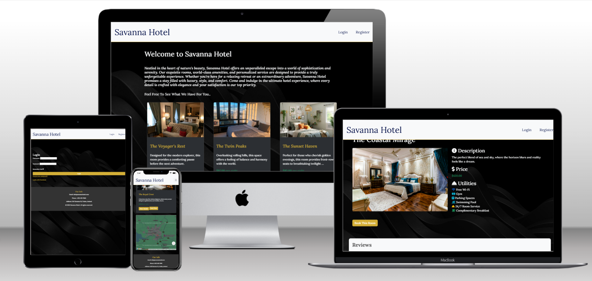

# Table of Contents

* [**Goals**](<#goals>)
    * [External User's Goal](<#external-users-goal>)
    * [Site Owner's Goal](<#site-owners-goal>)
* [**User Experience (UX)**](#user-experience)
    * [Entity Relationship Diagram (ERD)](#entity-relationship-diagram-erd)
    * [Wireframes](#wireframes)
    * [User Stories](#user-stories)
    * [Site Structure](#site-structure)
    * [Design Choices and Color Scheme](#design-choices-and-color-scheme)
* [**Features**](#features)
  * [Existing Features](#existing-features)
  * [Future Features](#future-features)
* [**Testing**](#testing)
* [**Deployment**](#deployment)
  * [Forking GitHub Repository](#forking-the-github-repository)
  * [Local Clone](#creating-a-local-clone)
* [**Credits**](#credits)

# Goals

### External User’s Goal:
Users can view room availability, book rooms, manage their bookings, and update personal details.

### Site Owner’s Goal:
Provide a simple and intuitive platform for guests to book rooms, view details, and interact with the hotel services.

[Back to top](<#table-of-content>)

# User Experience

## Entity Relationship Diagram (ERD)

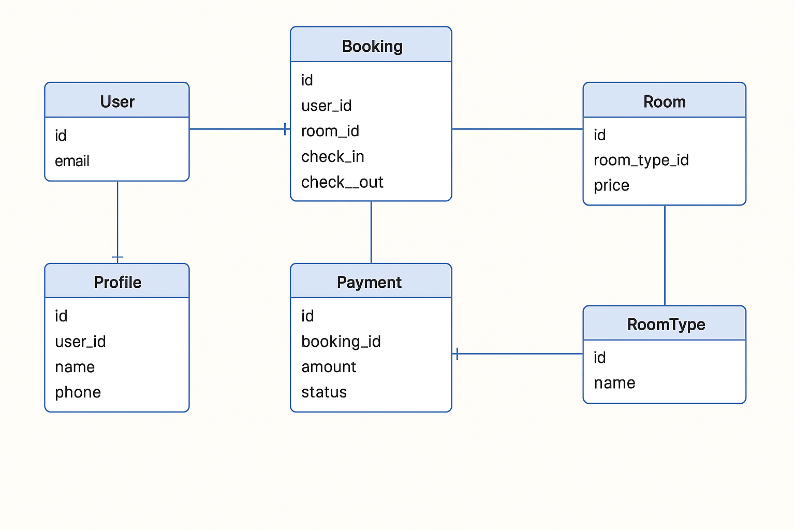

## Wireframes

The wireframes were created with [Balsamiq](https://balsamiq.cloud/sihiecx/p9ewmui/r2278) for desktop and mobile devices.

* ### Home Page
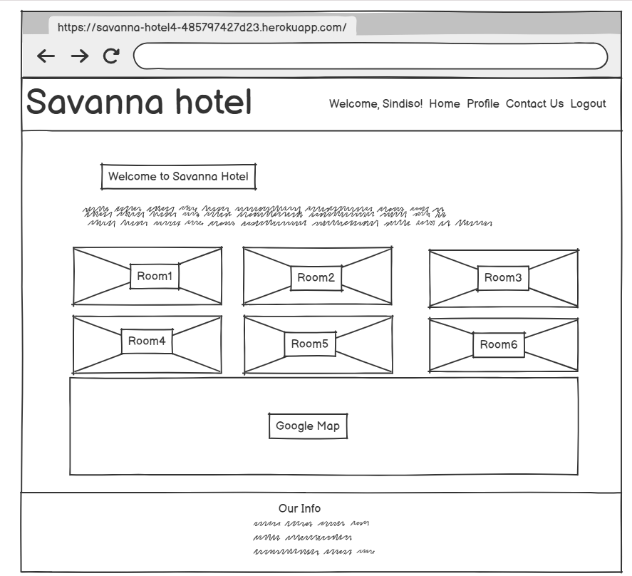

* ### Room Details Page
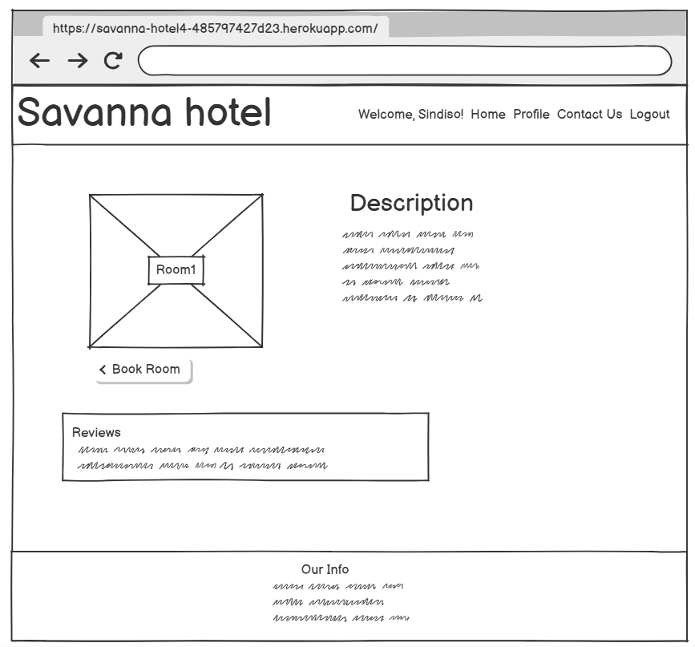

* ### Book Room Page
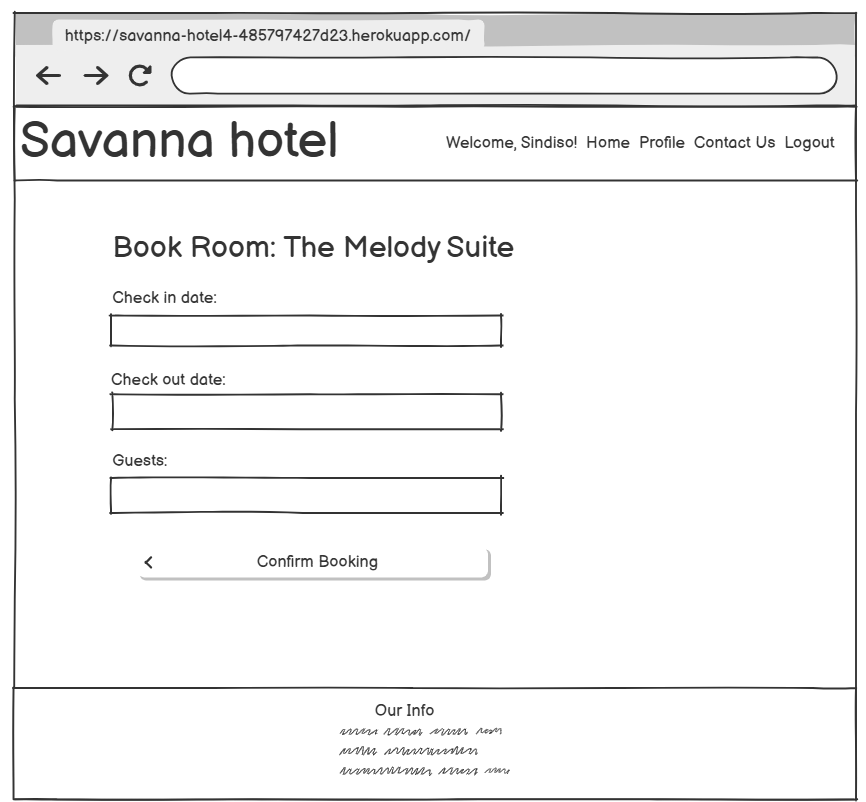

* ### Contact Page
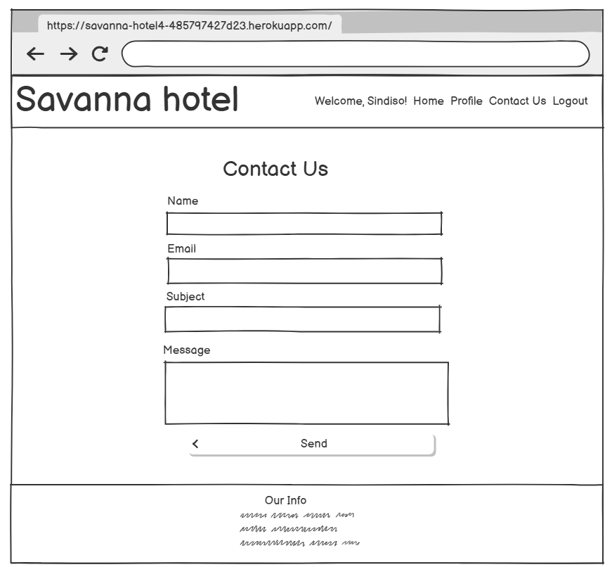

[Back to top](<#table-of-content>)

## User Stories 

Savanna Hotel was developed using an agile approach.  
User Stories on GitHub Projects: [GitHub Projects Board](https://github.com/users/CsClown/projects/5)

### - User Story: Account Management
As a guest, I can register, log in, and log out so that I can access and manage my bookings.

#### Acceptance Criteria:
- Guests can register a new account with a unique email and password.
- Registered users can log in using their credentials.
- Logged-in users can log out at any time.
- After logging in, users are redirected to their profile page.
- After logging out, users are redirected to the homepage.

###  -User Story: Room Booking
As a registered guest, I can book a room so that I can reserve my stay at the hotel.

#### Acceptance Criteria:
- Guests can browse available rooms.
- Guests can select a room, choose dates, and make a booking.
- After booking, the guest receives a confirmation email.
- The room is marked as unavailable for the selected dates.

### - User Story: View Booking Confirmation
As a guest, I want to see a clear booking confirmation page after I book so that I know my booking was successful.

#### Acceptance Criteria:
- A confirmation page appears after successful booking.
- Booking details are summarized (room, dates, total cost).

### - User Story: Cancel a Booking
As a guest, I want to cancel a future booking so that I am not charged or penalized for changes I make in advance.

#### Acceptance Criteria:
- Guests can view all their bookings.
- Guests can cancel bookings if they meet cancellation policy conditions.

### - User Story: Browse Rooms Without Account
As a guest, I want to view all available rooms and their details so that I can explore options before deciding to register or book.

#### Acceptance Criteria:
- Guests can see a list of available rooms.

- Guests can click on any room to view details like images, description, price, and amenities.
- Guests are prompted to log in or register when attempting to book.

### - User Story: Mobile Friendly Booking
As a guest, I want to easily browse and book rooms from my mobile device so that I can complete my booking from anywhere.

#### Acceptance Criteria:
- The site is fully responsive on mobile devices.
- Menus and buttons are touch-friendly.
- Forms are easy to fill on small screens.

### - User Story: View and Manage Bookings
As a guest, I can view and manage my bookings so that I can modify or cancel my reservations if needed.

#### Acceptance Criteria:
- Guests can view all their bookings.
- Guests can modify or cancel any upcoming bookings.
- Guests are notified via email about booking modifications or cancellations.


### - User Story: Update Profile
As a registered guest, I can update my profile so that I can keep my information up to date.

#### Acceptance Criteria:
- Guests can update their personal information, such as email and contact details.
- Changes are saved and reflected immediately on the profile page.

### - User Story: Contact the Hotel
As a guest or visitor, I want to send a message to the hotel so that I can ask specific questions or request additional information.

#### Acceptance Criteria:
- There is a contact form on the contact page.
- Upon submitting the form, a success or error message is displayed.
- The hotel receives the message via email.

### - User Story: Admin Management
As a hotel staff/admin, I want to manage rooms, bookings, and guest profiles so that I can maintain the platform and assist guests.

#### Acceptance Criteria:
- Admin users can create, update, or delete rooms.
- Admin users can view all bookings.
- Admin users can view guest profiles.


[Back to top](<#table-of-content>)

# Site Structure

The **Savanna Hotel** platform is organized to provide guests with a seamless booking and management experience. The site structure includes user-friendly sections for browsing rooms, making reservations, viewing bookings, and managing user profiles.

### Homepage
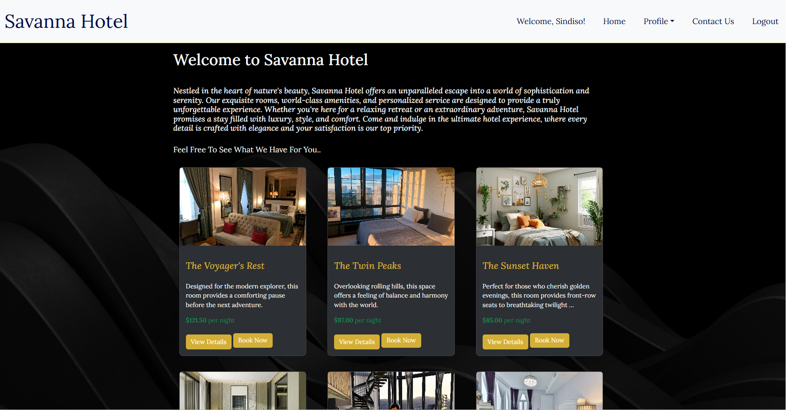
The homepage serves as the gateway for guests to explore room availability, view hotel details, and navigate to other sections of the site.

### User Authentication
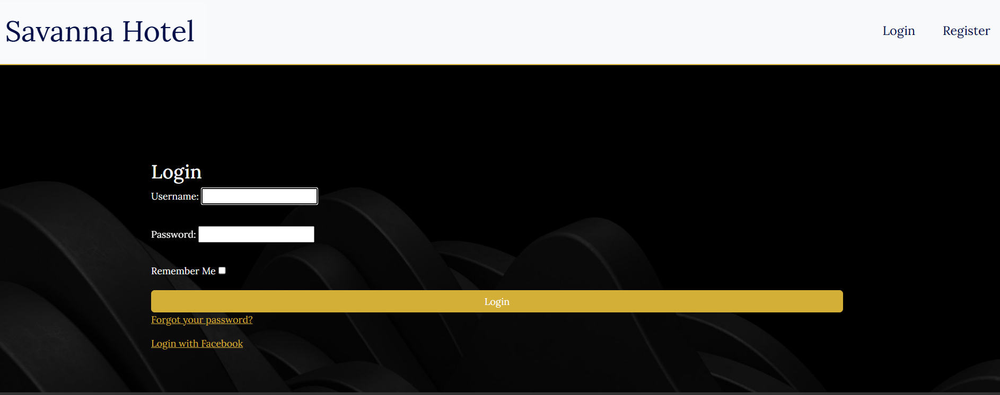
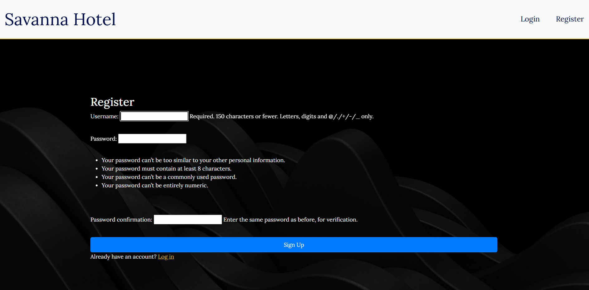
Guests can easily sign up, log in, and log out. The platform ensures a smooth authentication process, allowing guests to manage their bookings securely.

### Room Booking
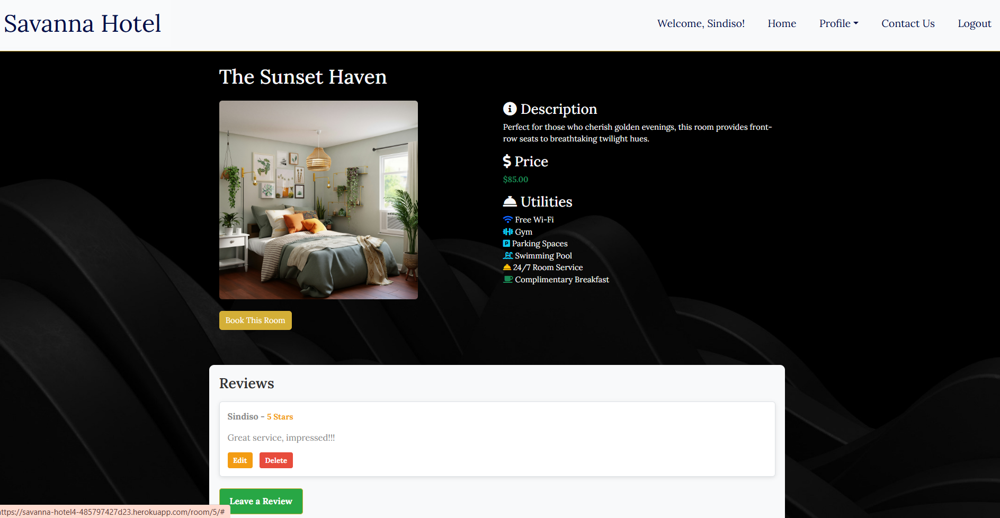
Guests can browse available rooms, view room details, and make bookings based on availability. The booking process is simple and intuitive, ensuring a seamless experience.

### My Bookings
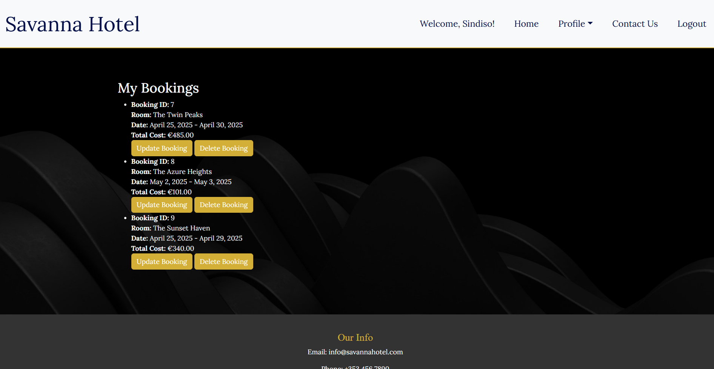
Guests can view their upcoming bookings, make modifications, or cancel bookings through their user profile page. This section provides an overview of all their past and future reservations.

### Contact Us
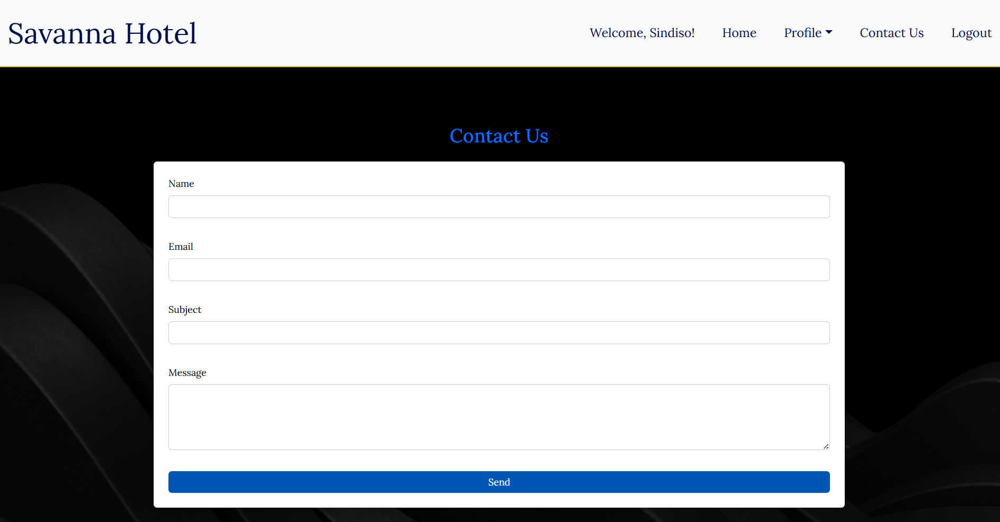
 Guests can go to the Contact Us page where they can send an email to Savanna hotel email for any query and get feedback when their mail is sent or failed to.

### User Profiles
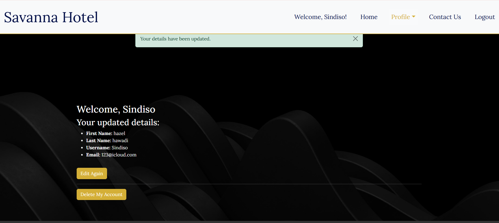
Each guest has a profile page that shows personal details. Guests can update their profiles to ensure their information is up to date.

[Back to top](<#table-of-content>)

# Design Choices and Color Scheme

The **Savanna Hotel** platform uses a modern and clean design to offer a seamless and pleasant user experience. The color scheme is carefully chosen to reflect a warm, welcoming atmosphere.

#### Typography
The site uses the 'Roboto' font family for a modern, clean, and readable design. This font enhances the overall aesthetic and readability of the platform.

#### Color Scheme
- **Primary Colors**: The primary color palette includes warm shades of **yellow** and **green**, symbolizing hospitality and nature, which are perfect for a hotel experience.
- **Backgrounds and Containers**: Black, Light beige and soft gray tones are used for backgrounds, ensuring content remains prominent and the interface stays easy on the eyes.
- **Interactive Elements**: Interactive elements such as buttons, links, and icons are highlighted with **green** for a friendly, engaging feel.

#### Custom CSS and Bootstrap Integration
The design integrates Bootstrap's responsive grid system with custom CSS to ensure a consistent and flexible experience across all devices.

[Back to top](<#table-of-content>)

# Features

## Existing Features

Savanna Hotel offers a variety of features to enhance the user experience, from easy room bookings to profile management and room availability checking.

### Room Booking System
- **Seamless Room Booking**: Guests can browse rooms and book directly from the platform. Room availability is updated in real-time to prevent double bookings.

- **Room Details**: Guests can view detailed descriptions of rooms, including images and pricing information.

### Profile Management
- **Create and Manage Profile**: Guests can create and manage their profiles, updating personal details like email, phone number, and address.

- **Booking Management**: Guests can view and manage their bookings, ensuring they have control over their reservations.

### Email Notifications
- **Booking Confirmation**: After sending a query, guests can see that their email was successfully sent or failed. sSavanna hotel will receive their email right away.

- **Booking Updates**: Guests can view any changes to their booking status.

### Responsive Design
- **Mobile-Friendly Layout**: The site is designed to work smoothly across all devices, offering a seamless experience for guests on both mobile and desktop.

[Back to top](<#table-of-content>)

## Future Features

As the **Savanna Hotel** platform evolves, additional features will be added to improve user experience:

- **Payment Integration**: Implement secure payment gateways for guests to pay directly when booking rooms.
- **Advanced Search Filters**: Allow guests to filter rooms by price, location, amenities, and availability.
- **Review System**: Enable guests to leave reviews and ratings for rooms they have stayed in.

[Back to top](<#table-of-content>)

# Technologies Used

## Languages
* [Python](https://en.wikipedia.org/wiki/Python_(programming_language))
* [HTML5](https://en.wikipedia.org/wiki/HTML)
* [CSS3](https://en.wikipedia.org/wiki/CSS)
* [JavaScript](https://en.wikipedia.org/wiki/JavaScript)

## Frameworks & Software
* [Django](https://www.djangoproject.com/)
* [Cloudinary](https://cloudinary.com/)
* [Bootstrap](https://getbootstrap.com/)
* [Heroku](https://en.wikipedia.org/wiki/Heroku)
* [Emailjs](https://dashboard.emailjs.com/admin)
* [Google Maps](https://developers.google.com/)

### Other
- Visual Studio Code
- Font awesome
- Github 
- Unsplashed
- Fontjoy
- Google fonts
- Pexels
- Favicon.cc
- W3C Jigsaw CSS Validator
- Colorfilter
- FancyApp
- Code institute learning

[Back to top](<#table-of-content>)

## Testing
### Css
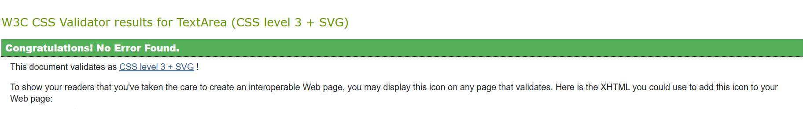


## Deployment

For good practice, this project was deployed early to [Heroku](https://www.heroku.com) in order to save time and avoid nasty surprises later on.

After installing Django and the supporting libraries, the basic Django project was created and migrated to the database. 

The database provided by Django [db.sqlite3](https://docs.python.org/3/library/sqlite3.html) is only accessible within the workspace environment. In order for Heroku to be able to access the database, a new database suitable for production needs to be created.  Heroku offers a postgres add-on at an extra charge. I am using a postgreSQL database instance hosted on [CI Database](https://dbs.ci-dbs.net/) as this service is free. 

<details>
<summary>Steps taken before deploying the project to Heroku</summary>

### Create the Heroku App

1. Login to Heroku and click on the top right button ‘New’ on the dashboard. 
2. Click ‘Create new app’.
3. Give your app a unique name and select the region closest to you. 
4. Click on the ‘Create app’ button.

### Create the PostgreSQL Database

1. Login to https://dbs.ci-dbs.net/.
2. step 1: enter your email address and submit.  
3. step 2: creates a database.  
4. step 3: receive the database link on your email id. 

### Create the env.py file

With the database created, it now needs to be connected with the project.  Certain variables need to be kept private and should not be published to GitHub.  

1. In order to keep these variables hidden, it is important to create an env.py file and add it to .gitignore.  
2. At the top **import os** and set the DATABASE_URL variable using the `os.environ` method. Add the URL copied from instance created above to it, like so:
`os.environ[“DATABASE_URL”] = ”copiedURL”`
3. The Django application requires a SECRET_KEY to encrypt session cookies.  Set this variable to any string you like or generate a secret key on this [MiniWebTool](https://miniwebtool.com/django-secret-key-generator/).
`os.environ[“SECRET_KEY”] = ”longSecretString”`

### Modify settings.py 

It is important to make the Django project aware of the env.py file and to connect the workspace to the new database. 

1. Open up the settings.py file and add the following code. The if statement acts as a safety net for the application in case it is run without the env.py file.
```
import os
import dj_database_url

if os.path.isfile(‘env.py’):
    import env
```
2. Remove the insecure secret key provided by Django and reference the variable set in the env.py file earlier, like so:
```
SECRET_KEY = os.environ.get(‘SECRET_KEY’)
```
3. Hook up the database using the dj_database_url import added above.  The original DATABASES variable provided by Django connects the Django application to the created db.sqlite3 database within your repo.  This database is not suitable for production so comment out the existing db.sqlite3 and include the command as below for the new database. 

```
# Database
# https://docs.djangoproject.com/en/5.0/ref/settings/#databases

# DATABASES = {
#   'default': {
#       'ENGINE': 'django.db.backends.sqlite3',
#       'NAME': BASE_DIR / 'db.sqlite3',
#   }
# }

DATABASES = {
    'default': dj_database_url.parse(os.environ.get("DATABASE_URL"))
}
```

**NOTE**: If at the start of the development you are using the local db.sqlite3, make sure to add it to the .gitignore file, so as not to make the mistake of pushing it to your repository.  

5. Save and migrate this database structure to the newly connected postgreSQL database.  Run the migrate command in your terminal
`python3 manage.py migrate`

### Connect the Database to Heroku

1. Open up the Heroku dashboard, select the project’s app and click on the ‘Settings’ tab.
2. Click on ‘Reveal Config Vars’ and add the DATABASE_URL with the value of the copied URL from the database instance created on CI database.
3. Also add the SECRET_KEY with the value of the secret key added to the env.py file. 
4. If using gitpod another key needs to be added in order for the deployment to succeed.  This is PORT with the value of 8000.

### Setup the Templates Directory

In settings.py, add the following under BASE_DIR 
`DIRS = os.path.join(BASE_DIR, "templates")`

### Add the Heroku Host Name

In settings.py scroll to ALLOWED_HOSTS and add the Heroku host name.  This should be the Heroku app name created earlier followed by `.herokuapp.com`.  Add in `’localhost’` so that it can be run locally.
```
ALLOWED_HOSTS = [‘heroku-app-name.herokuapp.com’, ‘localhost’]
```

### Create the Directories and the Process File

1. Create the media, static and templates directories at the top level next to the manage.py file. 
2. At the same level create a new file called ‘Procfile’ with a capital ‘P’.  This tells Heroku how to run this project.  
3. Add the following code, including the name of your project directory. 
```
web: gunicorn bitcoin_buzz.wsgi
```
* ‘web’ tells Heroku that this a process that should accept HTTP traffic.
* ‘gunicorn’ is the server used.
* ‘wsgi’, stands for web services gateway interface and is a standard that allows Python services to integrate with web servers.
4. Save everything and push to GitHub. 

</details>

<details>
<summary>First Deployment</summary>

### First Deployment

1. Go back to the Heroku dashboard and click on the ‘Deploy’ tab.  
2. For deployment method, select ‘GitHub’ and search for the project’s repository from the list. 
3. Select and then click on ‘Deploy Branch’.  
4. When the build log is complete it should say that the app has been successfully deployed.
5. Click on the ‘Open App’ button to view it and the Django “The install worked successfully!” page, should be displayed. 

</details>

<details>
<summary>Final Deployment</summary>

### Final Deployment

1. When development is complete, if you had left `DEBUG = True` in the settings.py file, make sure to change it to `False`. You don't have to change anything if you had used `DEBUG = 'DEVELOPMENT' in os.environ` as your env.py file is ignored by GitHub. 
2. Commit and push your code to your project's repository.
3. Then open up Heroku, navigate to your project's app. Click on the 'settings' tab, open up the config vars and delete the DISABLE_COLLECTSTATIC variable. 
4. Navigate to the 'Deploy' tab and scroll down to 'Deploy a GitHub branch'.
5. Select the branch you want to deploy and click on the 'Deploy branch' button. When the app is deployed, you should see a message in the built log saying "Your app was successfully deployed".  Click 'View' to see the deployed app in the browser. Alternatively, you can click on the 'Open App' button at the top of the page. 

</details>

_____

### Forking the GitHub Repository

<details>
<summary>Steps to Fork the GitHub Repository</summary>

Forking allows you to view and edit the code without affecting the original repository

1. Locate the GitHub repository. Link to this repository can be found [here](https://github.com/CsClown/bitcoin-buzz).
2. Click on 'Fork', in the top right-hand corner.
3. This will take you to your own repository to a fork with the same name as the original branch.

</details>

_____

### Creating a Local Clone

<details>
<summary>Steps to Creating a Local Clone</summary>

1. Go to the GitHub repository. Link to this repository can be found [here](https://github.com/CsClown/bitcoin-buzz).
2. Click on 'Code' to the right of the screen. This will open a dropdown. Click on HTTPs and copy the link.
3. Open Git Bash in your IDE and change the current working directory to the location where you want the cloned directory.
4. Type `git clone`, paste the URL you copied earlier, and press Enter to create your local clone.

More information on Creating and Managing repositories can be found [here](https://docs.github.com/en/repositories/creating-and-managing-repositories/cloning-a-repository)
<br>

</details>

[Back to top](<#table-of-content>)

# Credits
## Images
* Pixabay [Pexels](https://www.pexels.com/)
* Quang Nguyen Vinh [Pexels](https://www.pexels.com/)
* SVH Manali [Pexels](https://www.pexels.com/)
* Rana Matloob Hussain [Pexels](https://www.pexels.com/)
* edithub pro [Pexels](https://www.pexels.com/)
* Vojtech Bruzek [Unsplash](https://unsplash.com/)
* Mark champs [Unsplash](https://unsplash.com/)
* Chastity Cortijo [Unsplash](https://unsplash.com/)
* Devon Janse van Rensburg [Unsplash](https://unsplash.com/)
* Spacejoy [Unsplash](https://unsplash.com/)
* Lotus Design [Unsplash](https://unsplash.com/)
* Collov Home Design [Unsplash](https://unsplash.com/)
* Marin huang [Unsplash](https://unsplash.com/)
* iwood [Unsplash](https://unsplash.com/)
* Visualsofdana [Unsplash](https://unsplash.com/)
* reisetopia [Unsplash](https://unsplash.com/)
* olexandr Ignatov [Unsplash](https://unsplash.com/)
* ikhbale [Unsplash](https://unsplash.com/)
* huy Nguyen [Unsplash](https://unsplash.com/)
* KKY [Unsplash](https://unsplash.com/)
* David Kristianto [Unsplash](https://unsplash.com/)
* Salman Soqib [Unsplash](https://unsplash.com/)
* Zac Gudakov [Unsplash](https://unsplash.com/)
* dada_design [Unsplash](https://unsplash.com/)

# Acknowledgements
This site was created for Portfolio Project #4 (Full-Stack Tolkin) - Diploma in Full Stack Software Development Diploma at the [Code Institute](https://www.codeinstitute.net).